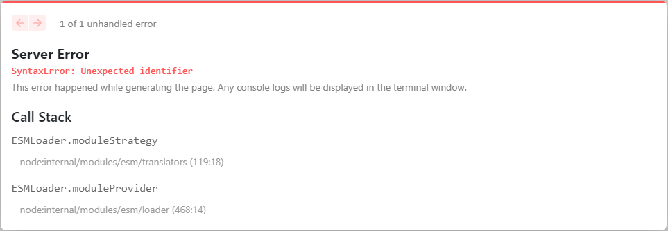

## Table of Contents

- [Templates](#templates)
- [Youtube](#templates)
- [Errors](#errors)

## Templates

[templates](https://vercel.com/templates/next.js/skeleton)

## Youtube

App Directory with suspense
[Loading UI with Next.js 13 and React Suspense](https://www.youtube.com/watch?v=2o5m1ovfl3c)

## Errors

ESMLoader.moduleStrategy
ESMLoader.moduleProvider

[next.js issues](https://github.com/vercel/next.js/issues/39375)
